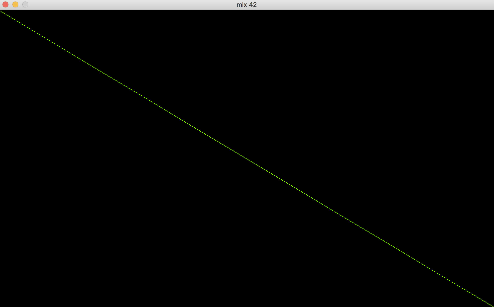
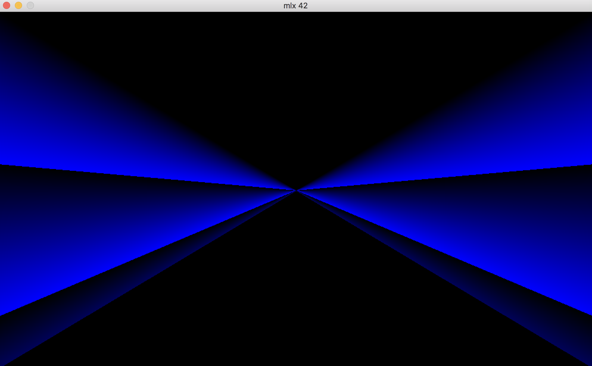
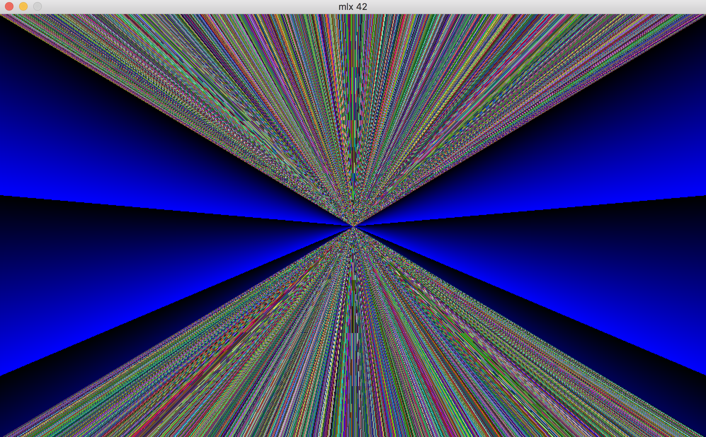
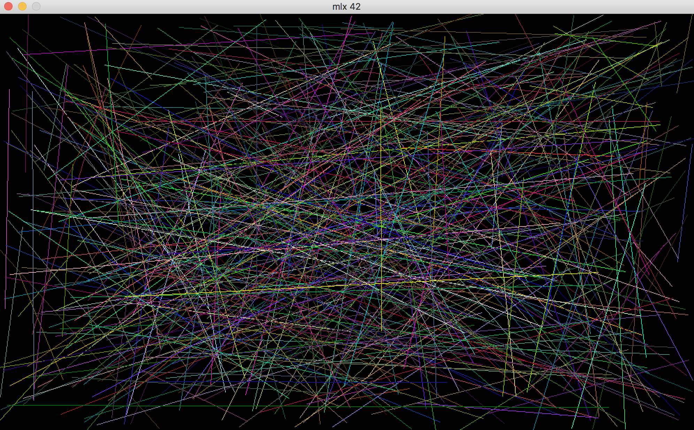

# FDF

[man mlx](https://github.com/qst0/ft_libgfx)

## STEP 1. Bresenham's line algorithm
A line connects two points. It is a basic element in graphics. To draw a line, you need two points between which you can draw a line. And an algorithm to do this. [Bresenham's line algorithm](https://en.wikipedia.org/wiki/Bresenham%27s_line_algorithm) can use integer calculations, so it works faster than approaches with floats. This algorithm is needed in order to draw a line at any angle and in any direction (and not just proceeding from the [origin](https://en.wikipedia.org/wiki/Origin_(mathematics))). On our screen the origin is in the upper left corner of the screen: `y` increases, when we step down, `x` grows as we move to the right. Going through understanding the algorithm, becomes clear, that we have two cases: 1) `deltaX(x1 - x0) > deltaY(y1 - y0)` : `x` is increased each iteration, about `y` we should make decision - keep it same or increase by step (1 or -1: depends on direction of the line). This case draws lines only if the inclination of the line is less then 45 degrees. 2) `deltaX(x1 - x0) < deltaY(y1 - y0)` : `y` is increased each iteration, about `x` we should make decision - keep it same or increase by step (1 or -1: depends on direction of the line). This case draws lines only if the inclination of the line is more then 45 degrees. Let's visualize it.

### Case 1. `deltaX(x1 - x0) > deltaY(y1 - y0)` (x++)

Here is the structure, that i use (for your understanding of the variable names):
```
# define WIDTH 1000
# define HEIGHT 600

typedef struct	s_env
{
	void		*mlx;
	void		*win;
	int			step_x;
	int			step_y;
	int			dx;
	int			dy;
	int			x0;
	int			x1;
	int			y0;
	int			y1;
	int			line_color;
}				t_env;
```

And the implementation of Bresenham's line algorithm (i split the code into several functions for clarity):
```
/* if dy <= dx */
static	void		ft_draw_dx(t_env *e)
{
	int	error;
	int	i;
	int	x;
	int	y;

	error = (e->dy << 1) - e->dx;
	x = e->x0 + e->step_x;
	y = e->y0;
	i = 1;
	mlx_pixel_put(e->mlx, e->win, e->x0, e->y0, e->line_color);
	while (i <= e->dx)
	{
		if (error > 0)
		{
			y += e->step_y;
			error += (e->dy - e->dx) << 1;
		}
		else
			error += e->dy << 1;
		mlx_pixel_put(e->mlx, e->win, x, y, e->line_color);
		x += e->step_x;
		i++;
	}
}

/* if dy >= dx */
static	void		ft_draw_dy(t_env *e)
{
	int	error;
	int	i;
	int	x;
	int	y;

	error = (e->dx << 1) - e->dy;
	y = e->y0 + e->step_y;
	x = e->x0;
	i = 1;
	mlx_pixel_put(e->mlx, e->win, e->x0, e->y0, e->line_color);
	while (i <= e->dy)
	{
		if (error > 0)
		{
			error += (e->dx - e->dy) << 1;
			x += e->step_x;
		}
		else
			error += e->dx << 1;
		mlx_pixel_put(e->mlx, e->win, x, y, e->line_color);
		y += e->step_y;
		i++;
	}
}

/* making a decision: deltaX > deltaY || deltaX > deltaY */
/* also we should figure out the value of step (1 or -1) */
void				bresenham_line(t_env *e)
{
	e->dx = abs(e->x1 - e->x0); /* delta x */
	e->dy = abs(e->y1 - e->y0); /* delta y */
	e->step_x = e->x1 >= e->x0 ? 1 : -1; /* stepx if line (from left to right) = +1 ; else = -1 */
	e->step_y = e->y1 >= e->y0 ? 1 : -1; /* stepy if line (from up to down) = +1 ; else = -1 */
	if (e->dx > e->dy)
		ft_draw_dx(e);
	else
		ft_draw_dy(e);
}

```

Simple main.c (just to see how the algorithm works when dy <= dx):

```
int			main(void)
{
	int 	color;
	t_env 	*e;

	if (!(e = malloc(sizeof(t_env))))
		return (0);
	color = 8388352;
	e->mlx = mlx_init();
	e->win = mlx_new_window(e->mlx, WIDTH, HEIGHT, "mlx 42");
	e->x0 = 0;
	e->x1 = WIDTH;
	e->y0 = 0;
	e->y1 = HEIGHT;
	e->line_color = 8388352;
	bresenham_line(e);
	mlx_loop(e->mlx);
	return (0);
}

```

Run:
```
gcc -I /Users/kprytkov/FDF/go_MinilibX main.c -L /usr/local/lib -lmlx -framework OpenGL -framework Appkit
```



Modify your main.c in this way and you will see the entire spectrum of the action of the function `ft_draw_dx()`:

```
int			main(void)
{
	int 	color;
	t_env 	*e;

	if (!(e = malloc(sizeof(t_env))))
		return (0);
	color = 8388352;
	e->mlx = mlx_init();
	e->win = mlx_new_window(e->mlx, WIDTH, HEIGHT, "mlx 42");
	for (int j = 0; j < HEIGHT; j++)
	{
		e->x0 = 0 + WIDTH / 2;
		e->x1 = WIDTH;
		e->y0 = 0 + HEIGHT / 2;
		e->y1 = j;
		e->line_color = j;
		bresenham_line(e);
	}	
	for (int j = 0; j < HEIGHT; j++)
	{
		e->x0 = WIDTH / 2;
		e->x1 = 0;
		e->y0 = HEIGHT / 2;
		e->y1 = j;
		e->line_color = j;
		bresenham_line(e);
	}
	mlx_loop(e->mlx);
	return (0);
}
```


Case 2. `deltaX(x1 - x0) < deltaY(y1 - y0)` (y++)

And to see both cases (ft_draw_dx() && ft_draw_dy() are working together; colors are just my imagination):

```
int			main(void)
{
	int 	color;
	t_env 	*e;

	if (!(e = malloc(sizeof(t_env))))
		return (0);
	color = 8388352;
	e->mlx = mlx_init();
	e->win = mlx_new_window(e->mlx, WIDTH, HEIGHT, "mlx 42");
	for(int j = 0; j < WIDTH; j++)
	{
		e->x0 = WIDTH / 2;
		e->x1 = j;
		e->y0 = HEIGHT / 2;
		e->y1 = HEIGHT;
		e->line_color = random();
		bresenham_line(e);
	}
	for(int j = 0; j < WIDTH; j++)
	{
		e->x0 = WIDTH / 2;
		e->x1 = j;
		e->y0 = HEIGHT / 2;
		e->y1 = 0;
		e->line_color = random();
		bresenham_line(e);
	}
	mlx_loop(e->mlx);
	return (0);
}
```


And just for fun:
```
int			main(void)
{
	int 	color;
	t_env 	*e;

	if (!(e = malloc(sizeof(t_env))))
		return (0);
	color = 8388352;
	e->mlx = mlx_init();
	e->win = mlx_new_window(e->mlx, WIDTH, HEIGHT, "mlx 42");
	for (int i = 0; i <= 500; i++)
	{
		e->x0 = random() % WIDTH - 1;
 		e->x1 = random() % WIDTH - 1;
 		e->y0 = random() % HEIGHT - 1;
 		e->y1 = random() % HEIGHT - 1;
 		e->line_color = random();
 		bresenham_line(e);
	}
	mlx_loop(e->mlx);
	return (0);
}
```
